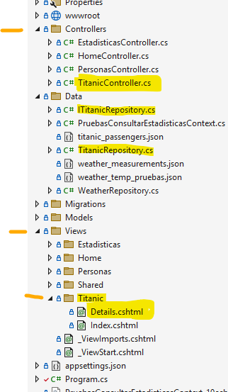

# Desarrollo web Microsoft, ASP.NET

[ASP.NET Core](https://dotnet.microsoft.com/en-us/apps/aspnet)

[ASP.NET Core documentation](https://learn.microsoft.com/en-us/aspnet/core/)

## Diversas alternativas

Hay variadas maneras de trabajar. Entre las que están actualmente (2024) en vigor están:

- `ASP.NET Core Web App (Model-View-Controller) (MVC)`, para las tradicionales aplicaciones web con un backend de gestión y un frontend de interface de usuario. (nota: el frontend usa bootstrap y jquery). [Introducción](https://learn.microsoft.com/es-es/aspnet/core/tutorials/first-mvc-app/start-mvc)
 
- `ASP.NET Core Web API`, para servicios backend que se van a utilizar mediante llamadas HTTP a endpoints (URLs). (Lo que se suele conocer como APIs REST.)

- `ASP.NET Core gRPC`, para servicios backend que van a utilizar mediante llamadas RPC (Remote Procedure Call). [Introducción](https://learn.microsoft.com/es-es/aspnet/core/grpc)

- `ASP.NET Core Web App (Razor pages)`, para aplicaciones web "de-una-sola-pagina" (SPA, Single Page Application). La página que se descarga en el navegador del usuario se va reformando a sí misma y va solicitando los datos que necesite, llamando a APIs en servidores backend. [Introducción](https://learn.microsoft.com/es-es/aspnet/core/razor-pages/)

- `Blazor WebAssembly`, para aplicaciones web "de-una-sola-pagina" (SPA) que requieran de gran interactividad en el frontend del usuario. La mayor parte del código (C#) se ejecuta en el navegador del usuario, usando compilación a WebAssembly. (Es decir, es una "client-side-app".) [Introducción Blazor](https://learn.microsoft.com/es-es/aspnet/core/blazor/) ~~~~ [Introducción a WebAssembly](https://en.wikipedia.org/wiki/WebAssembly)

- `Blazor Server`, para aplicaciones web que requieran de gran interactividad en el frontend del usuario, pero también se requiera ejecutar la mayor parte del código en el servidor backend. (Es decir, es una "server-side-app")

Entre las maneras de trabajar que están actualmente "deprecated", pero de las cuales aún hay código funcionando en el mercado, están:

- ASP.NET Web Forms

- ASP.NET MVC (Model-View-Controller)

- ASP.NET Web API

- WCF (Windows Communication Foundation). Un híbrido entre SOA (Service Oriented Architecture), web APIs y llamadas RCP entre aplicaciones. En estos momentos (2024) está difunto; el propio Microsoft recomienda usar ASP.Net gRPC en lugar de WCF. (https://learn.microsoft.com/en-us/dotnet/framework/wcf/whats-wcf#grpc-as-an-alternative-to-wcf)


### ASP.NET Core Web App MVC

nota: De entre todas las formas de desarrollar aplicaciones Web "a la Microsoft...", esta es la más parecida a como se desarrollan aplicaciones web estándares con la triada base (HTML, CSS, Javascript) para el frontend y con algún otro lenguaje para el backend (en este caso C#). Aunque cabe destacar también que ASP.NET Web tiene muchas peculiaridades "Microsofizantes".

[Overview of ASP.NET Core MVC](https://learn.microsoft.com/en-us/aspnet/core/mvc/overview)

### ASP.NET Core Razor

Razor es una amalgama de HTML, CSS, anotaciones y scripts C#. Desde el servidor se descarga una sola página .cshtml, la página inicial. Y esta página se va modificando a sí misma en el navegador, según sea necesario para ir mostrando las distintas partes de la aplicación.

Es decir, la aplicación es "de-una-sola-pagina", (SPA, Single Page Application)

Los datos necesarios, se van solicitando desde la propia página. Con llamadas a APIs en servidores backend.

[cshtml](https://learn.microsoft.com/en-us/aspnet/core/mvc/views/razor)


### ASP.NET Core Blazor

Blazor es código .Net que se ejecuta en el navegador del usuario utilizando WebAssembly. En el fondo una aplicación Blazor es como una aplicación de escritorio, pero servida desde un servidor web y ejecutándose dentro de un navegador web. (Desde otro punto de vista, es cómo una especie de SPA; pero mucho más sofisticada.)

Las aplicaciones Blazor tienen acceso a prácticamente toda la biblioteca .Net

nota: Si se desea, también se puede hacer que la mayor parte de la aplicación Blazor se ejecute en el lado servidor en vez de en el lado navegador. (Es mejor para el tema SEO y para el tema de proteger secretos.) Esto se consigue usando `Blazor Server`. En ese caso, se establece una comunicación bidireccional fluida entre el frontend y el backend con el protocolo [SignalR](https://learn.microsoft.com/en-us/aspnet/core/signalr/introduction) propio de Microsoft.


## Estructura de una aplicación ASP.NET Core Web App MVC

[ASP.NET MVC Pattern - A design pattern for achieving a clean separation of concerns](https://dotnet.microsoft.com/en-us/apps/aspnet/mvc)

Como se ha comentado, esta es la forma de trabajar más parecida a las aplicaciones web estandares que se suelen realizar con la triada base (HTML, CSS, Javascript) más algún marco de trabajo (Node, React, NestJS,...) más algún lenguaje para el backend (Java, Python, Javascript,...)


### Inicialización y arranque

Directamente en la raiz del proyecto, va el archivo `Program.cs`. Es el encargado de crear e inicializar (más bien de construir y montar, puesto que usa un "builder") los diversos componentes necesarios para la aplicación.

https://learn.microsoft.com/en-us/aspnet/core/fundamentals


### Los datos y la lógica de negocio (Model)

Lo primero que se suele construir en las aplicaciones MVC es la M (Model): la lógica de negocio y la gestión de datos. 

Ese modelo, junto con el manejo de la infraestructura técnica en el servidor (o servidores), es lo que se suele conocer como "back-end" en las aplicaciones web. 

Es muy importante intentar mantener separada 
- la lógica de negocio y sus datos (el modelo propiamente dicho), 
- de los recursos necesarios para hacerla funcionar (la infraestructura tecnológica). 

Para que las dependencias entre el modelo y la infraestructura queden bien claras. Son muy útiles técnicas tales como la inyección de dependencias. [Dependency Injection - Principles, Practices, and Patterns](https://www.amazon.es/Dependency-Injection-Principles-Practices-Patterns-ebook/dp/B09783WN5C/)

[Dependency injection in ASP.NET Core](https://learn.microsoft.com/en-us/aspnet/core/fundamentals/dependency-injection)

Por otro lado, para ir ejercitando y comprobando la lógica de negocio según se va escribiendo. Son de gran ayuda los test unitarios. [Unit Testing - Principles, Practices and Patterns](https://www.amazon.es/gp/product/B09782L692/ref=ppx_yo_dt_b_d_asin_title_o02)

En ASP.NET:

- La lógica de negocio y las definiciones de los objetos de datos suelen ir bajo la carpeta `Models`. 

- La base de datos suele ir bajo la carpeta `Data`.


### El interfaz gráfico de usuario (View)

Lo segundo que se suele construir en las aplicaciones MVC es la V (View): algún medio para que las personas usuarias puedan interactuar con el programa. 

En las aplicaciones web, esa interacción suele ser a través de un interfaz gráfico web, usando un navegador. Es lo que se suele conocer como "front-end".

En ASP.NET, ese interfaz se compone de "vistas" (páginas Razor). Estas páginas suelen ir bajo la carpeta `Views`.

Si varias páginas van a compartir partes comunes, las definiciones de esas partes comunes van en la carpeta `Views` \ `Shared`. 

Concretamente, es importante el archivo `_Layout.cshtml`. Ese archivo es el marco base que se aplica a todas las páginas de la aplicación. Es donde normalmente van la cabecera, el menú de navegación general, el pié de página, la carga de scripts generales,...

Por otro lado, si se usan recursos estáticos (aquellos que se descargan tal cual al navegador): CSS, imágenes, Javascript,...  estos van bajo la carpeta `wwwroot`.

nota: Las páginas web Razor son una mezcla de código HTML y de código C#. De ahí que su extensión sea `.cshtml`


### La relación entre ambos (Controller)

La V (View) no suele poder funcionar sin la C (Controller). Los controladores son los encargados de:
- crear y gestionar las distintas partes del interfaz, 
- suministrar datos según el interfaz lo requiera, 
- reaccionar a las acciones que realice el usuario sobre el interfaz,

Para ello, los controladores interactúan con la M (Model).

En ASP.NET los controladores suelen ir en la carpeta `Controllers`


### Configuración vs Convención

- Algunas plataformas funcionan por configuración: los elementos se relacionan explícitamente, indicando expresamente todas y cada una de las relaciones en el propio código o en archivos externos de configuración.

- Otras plataformas funcionan por convención: los elementos se relacionan automáticamente según la nomenclatura que se les dé, según la carpeta en la que estén,...

ASP.NET es de estas últimas (funciona por convención). Esto permite ahorrar mucho tecleo. Pero obliga a respetar ciertas normas de escritura de forma estricta.

Nombres coincidentes entre un archivo en `Controllers` y una carpeta en `Views` son suficientes para relacionar controladores con sus respectivas vistas.

Por ejemplo: un método `public IActionResult Details()` de un controlador `xxxxxxxxxxxController.cs` dentro de la carpeta `Controllers` estará automáticamente relacionado con su respectiva vista `Details.cshtml` en la subcarpeta `xxxxxxxxxxx` dentro de la carpeta `Views`.



```
    public class TitanicController : Controller
../..
        public IActionResult Details(string? id)
        {
            if (id == null)
            {
                return NotFound();
            }

            var pasajero = fuenteDeDatos.getPasajero(id);
            if (pasajero == null)
            {
                return NotFound();
            }

            return View(pasajero);
        }
../..
```

Si no fuera por la convención, habria que haber configurado expresamente la ruta con sentencias como estas:
```
app.MapControllerRoute(
    name: "Titanic Passenger Details",
    pattern: "{controller=Titanic}/{action=Details}/{id?}");
```
Pero siguiendo las convenciones de nombres, el enrutamiento es automático y no es necesario configurar expresamente cada ruta.

[Tutorial - Part-7: Designing form to take input from the user](https://www.youtube.com/watch?v=UeVzc6GotoY&list=PLdHN14J7CHtZD-jyGq9Y97yC0Fvhzampy&index=7)


#### Scaffolded items

La mejor manera de que "todo cuadre" suele ser utilizar alguno de los asistentes para generar el controlador, la vista y el enlace con el ORM-basededatos.

Por ejemplo, clic-dcho sobre la carpeta `Controllers` y 'Add' 'New Scaffolded Item...' 'MVC Controller with views, using Entity Framework'.


### Seguridad HTTPS

Si vemos este error al arrancar la aplicación recién creada desde la plantilla:

> Unable to configure HTTPS endpoint. No server certificate was specified, and the default developer certificate could not be found or is out of date.
To generate a developer certificate run 'dotnet dev-certs https'. To trust the certificate (Windows and macOS only) run 'dotnet dev-certs https --trust'.
For more information on configuring HTTPS see https://go.microsoft.com/fwlink/?linkid=848054.

Hacerle caso, abrir un terminal desde dentro de Visual Studio y lanzar esos dos comandos:
````
**********************************************************************
** Visual Studio 2022 Developer PowerShell v17.9.6
** Copyright (c) 2022 Microsoft Corporation
**********************************************************************
PS C:\xxxxxxxxxxxx> dotnet dev-certs https
The HTTPS developer certificate was generated successfully.
PS C:\xxxxxxxxxxxx> dotnet dev-certs https --trust
Trusting the HTTPS development certificate was requested. A confirmation prompt will be displayed if the certificate was not previously trusted. Click yes on the prompt to trust the certificate.
Successfully trusted the existing HTTPS certificate.
PS C:\xxxxxxxxxxxx>
````


## Algunos conceptos

### POCO (Plain Old Clr Object)

Al estilo de los POJO (Plain Old Java Objects). Son clases simples, que solo tienen propiedades. (Aunque pueden tener también algún que otro pequeño método para manejar datos o para hacer conversiones.)

Los POCO son la base que define los datos que va a manejar la aplicación.

Habitualmente, un ORM (en el caso de Microsoft: EF -Entity Framework-) se suele encargar de almacenar y recuperar esos objetos en la base de datos. Realizando las correspondientes conversiones de ida y vuelta entre objetos en memoria y tablas|documentos en base de datos. (de forma automática, oculta, entre bambalinas)


### DTO (Data Transfer Object)

Son POCOs, pero destinados a hacer transferencias parciales de datos. Se utilizan cuando no se desea usar los propios POCOs directamente en algún trabajo. 

Habitualmente suelen ser derivados de algún POCO, pero reduciendo campos y añadiendo sendos métodos para convertir del POCO al DTO y del DTO al POCO.

También puede haber algún DTO que combine campos de varios POCOs en un solo objeto, para simplificar transferencias.


### ORM, mapeo entre los objetos de datos y la base de datos

Un ORM (Object-Relational Mapper) se encarga de convertir entre
- 'instancias de objetos" en la aplicación 
- y 'datos' en tablas relacionales. 

Usando un ORM, el trabajo de persistencia de datos se realiza con unas sencillas instrucciones de crear, leer, modificar o borrar (CRUD, create, read, update, delete). Y es automática la conversión de estas instrucciones de persistencia a las correspondientes instrucciones de la base de datos. (nota: esas instruciones autogeneradas no se suelen ni llegar a ver, trabajan "de fondo".)

Microsoft suele utilizar el ORM **`Entity Framework`** (EF): https://learn.microsoft.com/en-us/ef

En los programas ASP.NET, este marco de trabajo se utiliza a través de un `DbContext`.

https://learn.microsoft.com/es-es/ef/core/dbcontext-configuration/

https://learn.microsoft.com/en-us/aspnet/core/data/ef-mvc

[Tutorial - Part-3: Set up entity framework core](https://www.youtube.com/watch?v=iEOm7RGs1Y4&list=PLdHN14J7CHtZD-jyGq9Y97yC0Fvhzampy&index=3)


#### Migrations

EF tiene un concepto denominado "migraciones". Es el proceso de trasladar las definiciones de datos en las clases POJO a las estructuras de tablas en la base de datos.

La mayor parte de las veces el proceso es automático y se realiza de fondo. Pero, de vez en cuando, en según que momentos, será necesario realizar manualmente una de estas "migraciones"; por ejemplo, para inicializar la base de datos o para realizar una resincronización entre la base de datos y el código C#.

https://learn.microsoft.com/es-es/ef/core/managing-schemas/migrations/

Desde dentro de Visual Studio, se puede utilizar la cónsola de paquetes para lanzar los comandos de EF. Menú 'Tools' 'NuGet Package Manager' 'Package Manager Console'.

### JSON, formato para datos

[How to write .NET objects as JSON (serialize)](https://learn.microsoft.com/en-us/dotnet/standard/serialization/system-text-json/how-to)

[How to read JSON as .NET objects (deserialize)](https://learn.microsoft.com/en-us/dotnet/standard/serialization/system-text-json/deserialization)

truco: dentro de una clase vacia, 'Edit' 'Paste Special' ['Paste JSON as Classes'](https://learn.microsoft.com/en-us/dotnet/standard/serialization/system-text-json/deserialization#deserialize-without-a-net-class)

[Format response data in ASP.NET Core Web API](https://learn.microsoft.com/en-us/aspnet/core/web-api/advanced/formatting)

[JSON in minimal APIs](https://learn.microsoft.com/en-us/aspnet/core/fundamentals/minimal-apis/responses#json)


### API, interfaz para otros programas

Otros programas (o nuestro mismo programa) interactúan con el programa a través de una serie de servicios que se pueden llamar según se necesiten: una API. 

En las aplicaciones web, estos servicios suelen materializarse en forma de URLs (`endpoints`) que se pueden invocar para obtener datos o para realizar acciones.

[API fundamentals](https://learn.microsoft.com/en-us/aspnet/core/fundamentals/apis)

[Controller-based APIs](https://learn.microsoft.com/en-us/aspnet/core/web-api)

[Minimal APIs](https://learn.microsoft.com/en-us/aspnet/core/fundamentals/minimal-apis)

#### OpenAPI, especificaciones y documentación

Nació como `Swagger Specification`, pasando a llamarse `OpenAPI Specification` cuando esa empresa lo liberalizó.

https://en.wikipedia.org/wiki/OpenAPI_Specification

OpenAPI es un lenguaje para definir APIs. Adecuado tanto para ser leido por personas como para ser procesado automáticamente por máquinas.


## Algunos aspectos prácticos

### Botones, navegación y formularios

En las vistas, se colocan etiquetas `<a>` para indicar las llamadas que se desean hacer a los controladores:
- el atributo `asp-controller=` indica qué controlador manejará la llamada
- el atributo `asp-action=` indica el método del controlador que será llamado
```
    <a asp-controller="Titanic" asp-action="Details" asp-route-id="@item.PassengerId">Ver detalles</a>
```

Eso llama al correspondiente método en el controlador indicado:
```
public class TitanicController : Controller
{

../..

        public IActionResult Details(string? id)
        {
            if (id == null)
            {
                return NotFound();
            }

            var pasajero = fuenteDeDatos.getPasajero(id);
            if (pasajero == null)
            {
                return NotFound();
            }

            return View(pasajero);
        }

../..

}
```

nota: El atributo `asp-route-id` está asociada al parámetro `id` en la función. Sigue la convención asp-route-xxxxx, siendo xxxxx el nombre del parámetro.

[Tutorial - Part-8: How to handle form submission in asp.net core MVC](https://www.youtube.com/watch?v=MtK5lnKk5W0&list=PLdHN14J7CHtZD-jyGq9Y97yC0Fvhzampy&index=8)

[Tutorial - Part-16: How to edit and delete data using repository pattern](https://www.youtube.com/watch?v=XjxTCV3CoDM&list=PLdHN14J7CHtZD-jyGq9Y97yC0Fvhzampy&index=16)


### Filtrar y/o paginar una tabla larga con muchos datos

Cuando hay muchos datos, suele ser conveniente irlos presentando de x en x (de 10 en 10, o de 20 en 20, o...). Así se evita el despilfarro de recursos y tiempo de presentar, por ejemplo, varios miles de lineas de datos en una tabla cuando realmente solo se van a utilizar unas pocas decenas de esas líneas.

La técnica de paginación es sencilla: se presenta la primera página (las primeras x líneas), se indica cuántas páginas hay en total y se da algún mecanismo para solicitar una cualquiera de esas n páginas. Habitualmente se complementa con algún mecanismo para avanzar una página hacia delante y para retroceder una página hacia atrás.

nota: La paginación es más útil si los datos presentados siguen un orden. Por ejemplo alfabético, de menor a mayor,... Y más aún si el usuario puede elegir entre distintas ordenaciones en distintos campos.

nota: Otra técnica que complementa la paginación son los filtros. Es decir, presentar primero una pantalla donde el usuario pueda acotar ciertos criterios de búsqueda y luego presentar solo los datos que cumplan dichos criterios.

[Pagination in C#: Complete Guide with Easy Code Examples - C# Corner](https://www.c-sharpcorner.com/article/pagination-in-c-sharp-complete-guide-with-easy-code-examples/)

[Understanding `IQueryable<T>` in C#](https://dev.to/rasheedmozaffar/understanding-iqueryable-in-c-4n37)

[IQueryable vs IEnumerable - C# Corner](https://www.c-sharpcorner.com/article/iqueryable-vs-ienumerable/)

[Part-17: How to implement search functionality in asp.net core MVC](https://www.youtube.com/watch?v=gFGl_UGejsM&list=PLdHN14J7CHtZD-jyGq9Y97yC0Fvhzampy&index=17)

[Part-18: How to implement sorting functionality in asp.net core MVC](https://www.youtube.com/watch?v=IIGC5dvNrfI&list=PLdHN14J7CHtZD-jyGq9Y97yC0Fvhzampy&index=18)

[Tutorial - Part-19: How to implement pagination in asp.net core MVC | Asp.net core MVC 7.0 project](https://www.youtube.com/watch?v=L9VtwtoLvy8&list=PLdHN14J7CHtZD-jyGq9Y97yC0Fvhzampy&index=19)

```
    public IActionResult Index(string? filtroDeClase, int cantidadEnCadaPagina, int paginaAMostrar)
    {
        const string  VALOR_QUE_INDICA_TODAS = "0";
        List<SelectListItem> opcionesParaFiltrarPorClase = new List<SelectListItem>();
        opcionesParaFiltrarPorClase.Add(new SelectListItem { Text = "TODAS", Value = VALOR_QUE_INDICA_TODAS });
        foreach (string clase in fuenteDeDatos.getClasesEnQueSePodiaViajar())
        {
            opcionesParaFiltrarPorClase.Add(new SelectListItem { Text = clase, Value = clase });
        }
        if (string.IsNullOrEmpty(filtroDeClase))
        {
            filtroDeClase = VALOR_QUE_INDICA_TODAS;
        }
    
        List<TitanicPassenger> pasajeros = fuenteDeDatos.getTodosLosPasajeros();
    
        if(!filtroDeClase.Equals(VALOR_QUE_INDICA_TODAS))
        {
            pasajeros = pasajeros.Where(x => x.Pclass == filtroDeClase).ToList();
        }
    
        return View(new ListaPaginada<TitanicPassenger>(pasajeros, opcionesParaFiltrarPorClase, filtroDeClase, cantidadEnCadaPagina, paginaAMostrar));
    }
```

```
public class ListaPaginada<T>
{
    private readonly List<T> elementos;

    public List<Microsoft.AspNetCore.Mvc.Rendering.SelectListItem> opcionesDeFiltro { get; }
    public string opcionSeleccionada { get; }

    public int cantidadEnCadaPagina { get; }
    public int cantidadDePaginas { get; }
    public int paginaActual { get; }

    public ListaPaginada(List<T> elementos, 
                         List<Microsoft.AspNetCore.Mvc.Rendering.SelectListItem> opcionesDeFiltro, 
                         string opcionSeleccionada, 
                         int cantidadEnCadaPagina, 
                         int paginaAMostrar)
    {
        this.elementos = elementos;

        this.opcionesDeFiltro = opcionesDeFiltro;
        this.opcionSeleccionada = opcionSeleccionada;

        if (cantidadEnCadaPagina > 0)
        {
            this.cantidadEnCadaPagina = cantidadEnCadaPagina;
        }
        else
        {
            this.cantidadEnCadaPagina = 10;
        }

        this.cantidadDePaginas = (int)Math.Ceiling(elementos.Count / (double)this.cantidadEnCadaPagina);

        if (paginaAMostrar > 0)
        {
            this.paginaActual = paginaAMostrar;
        }
        else
        {
            this.paginaActual = 1;
        }
    }

    public List<T> getElementosDeLaPaginaActual()
    {
        return elementos.Skip((paginaActual - 1) * cantidadEnCadaPagina).Take(cantidadEnCadaPagina).ToList();
    }

}
```


```
@model ListaPaginada<TitanicPassenger>

@{
    ViewData["Title"] = "Titanic";
}

<h1>Pasajeros del Titanic</h1>

<div class="row m-5">
    <div class="col-md-6">
        <form class="d-flex" asp-controller="Titanic" asp-action="Index" asp-route-filtroDeClase="@Model.opcionSeleccionada">
            <label for="p_class">Filtrar según la clase en que viajaban: </label>
            <select name="filtroDeClase" class="form-control me-1 disabled" 
                    asp-items="@Model.opcionesDeFiltro" asp-for="@Model.opcionSeleccionada">
            </select>
            <button type="submit">Filtrar</button>
        </form>
    </div>
</div>

<table class="table">
    <thead>
        <tr>
            <th>
                Nombre
            </th>
            <th>
                Edad
            </th>
            <th>
                Clase en la que viajaba
            </th>
            <th>
                ¿Sobrevivió?
            </th>
            <th></th>
        </tr>
    </thead>
    <tbody>
@foreach (var item in Model.getElementosDeLaPaginaActual()) {
        <tr>
            <td>
                @item.Name
            </td>
            <td>
                @item.Age
            </td>
            <td>
                @item.Pclass
            </td>
            <td>
                @(item.Survived == "0" ? "No" : "Si")
            </td>
            <td>
                <a asp-action="Details" asp-route-id="@item.PassengerId">Ver detalles</a> |
            </td>
        </tr>
}
    </tbody>
</table>

<div class="row">
    <nav>
        <ul class="pagination justify-content-end">
            <p class="text-info mx-4">Página @Model.paginaActual , de @Model.cantidadDePaginas</p>
            <li class="page-item @(Model.paginaActual == 1 ? "disabled": "")">
                <a class="page-link " asp-route-numPagina="1" asp-route-filtroDeClase="@Model.opcionSeleccionada">
                    <span>Ir a la primera página</span>
                </a>
            </li>
            <li class="page-item @(Model.paginaActual == 1 ? "disabled": "")">
                <a class="page-link" asp-route-numPagina="@(Model.paginaActual - 1)" asp-route-filtroDeClase="@Model.opcionSeleccionada">
                    <span>Atras</span>
                </a>
            </li>
            <li class="page-item @(Model.paginaActual == Model.cantidadDePaginas ? "disabled": "")">
                <a class="page-link" asp-route-numPagina="@(Model.paginaActual + 1)" asp-route-filtroDeClase="@Model.opcionSeleccionada">
                    <span>Adelante</span>
                </a>
            </li>
            <li class="page-item @(Model.paginaActual == Model.cantidadDePaginas ? "disabled": "")">
                <a class="page-link" asp-route-numPagina="@Model.cantidadDePaginas" asp-route-filtroDeClase="@Model.opcionSeleccionada">
                    <span>Ir a la última página</span>
                </a>
            </li>
        </ul>
    </nav>
</div>
```


### Llamar a APIs HTTP

```
    client = new HttpClient();
    client.BaseAddress = new Uri("https://developer.api.autodesk.com/");

../..

    HttpRequestMessage peticion = new HttpRequestMessage(
        HttpMethod.Post,
        "insights/v1/exports"); // https://developer.api.autodesk.com/insights/v1/exports
    peticion.Headers.Add("Authorization", $"Bearer {tokenDeAcceso}");
    
    HttpContent cuerpoDeLaPeticion = System.Net.Http.Json.JsonContent.Create(new
        {
            outputFormat = "CSV",
            reports = new[] { "USAGE_REPORT" },
            usageReports = new[] { "USAGE_REPORT_BY_PRODUCT" },
            startDate = System.Xml.XmlConvert.ToString(fechaInicio.ToDateTime(new TimeOnly()), System.Xml.XmlDateTimeSerializationMode.Utc),
            endDate = System.Xml.XmlConvert.ToString(fechaFin.ToDateTime(new TimeOnly()), System.Xml.XmlDateTimeSerializationMode.Utc),
            //filters = new[] { },
    });
    cuerpoDeLaPeticion.Headers.ContentType = new System.Net.Http.Headers.MediaTypeHeaderValue("application/json");
    peticion.Content = cuerpoDeLaPeticion;
    
    HttpResponseMessage respuesta = await client.SendAsync(peticion);
    System.Text.Json.Nodes.JsonNode contenidoDeLaRespuesta = System.Text.Json.Nodes.JsonNode.Parse(await respuesta.Content.ReadAsStringAsync());
    registro.LogTrace($"La respuesta a la petición de informe USAGE_REPORT ha sido: [{respuesta.StatusCode}] {contenidoDeLaRespuesta}");
    if (respuesta.StatusCode == HttpStatusCode.OK)
    {
        return contenidoDeLaRespuesta["id"].ToString();
    }
    else
    {
        registro.LogDebug($"La respuesta a la petición de informe USAGE_REPORT ha sido: [{respuesta.StatusCode}] {contenidoDeLaRespuesta}");
        throw new InvalidOperationException($"[{respuesta.StatusCode}] problemas en la solicitud de informe de usuarios y productos.");
    }

../..

    HttpRequestMessage peticion = new HttpRequestMessage(
        HttpMethod.Get,
        $"insights/v1/exports/{idDelInformeADescargar}");
    peticion.Headers.Add("Authorization", $"Bearer {tokenDeAcceso}");
    
    HttpContent cuerpoDeLaPeticion = System.Net.Http.Json.JsonContent.Create(new { });
    cuerpoDeLaPeticion.Headers.ContentType = new System.Net.Http.Headers.MediaTypeHeaderValue("application/json");
    peticion.Content = cuerpoDeLaPeticion;
    
    HttpResponseMessage respuesta = await client.SendAsync(peticion);
    System.Text.Json.Nodes.JsonNode contenidoDeLaRespuesta = System.Text.Json.Nodes.JsonNode.Parse(await respuesta.Content.ReadAsStringAsync());
    registro.LogTrace($"La respuesta a la descarga del informe ha sido: [{respuesta.StatusCode}] {contenidoDeLaRespuesta}");
    if (respuesta.StatusCode != HttpStatusCode.OK)
    {
        registro.LogDebug($"La respuesta a la descarga del informe ha sido: [{respuesta.StatusCode}] {contenidoDeLaRespuesta}");
        throw new InvalidOperationException($"[{respuesta.StatusCode}] problemas al recuperar el informe {idDelInformeADescargar}.");
    }
    else
    {
        string estadoDelInforme = contenidoDeLaRespuesta["status"].ToString();
        if (estadoDelInforme != "COMPLETED")
        {
            throw new InvalidOperationException($"El informe {idDelInformeADescargar} no está aún preparado; sigue en estado [{estadoDelInforme}].");
        }
        else
        {
            string url = contenidoDeLaRespuesta["downloads"][1]["downloadURL"].ToString();
            ........
        }
    }
```

```
    private HttpClient cliente = new HttpClient();

    public TitanicRepository() {
        cliente.BaseAddress = new Uri("http://localhost:8080/Titanic/");            
    }

    public async Task<List<TitanicPassenger>>  listaDePasajeros()
    {
        HttpRequestMessage peticion = new HttpRequestMessage(
             HttpMethod.Get,
             $"passengers"
         );
        HttpContent cuerpoDeLaPeticion = System.Net.Http.Json.JsonContent.Create(new { });
        cuerpoDeLaPeticion.Headers.ContentType = new System.Net.Http.Headers.MediaTypeHeaderValue("application/json");
        peticion.Content = cuerpoDeLaPeticion;

        HttpResponseMessage respuesta = await cliente.SendAsync(peticion);

        if (respuesta.StatusCode != HttpStatusCode.OK)
        {
            System.Console.WriteLine("Error " + respuesta.StatusCode + " en la llamada a " + peticion.RequestUri.ToString();
            return new List<TitanicPassenger>();
        }
        else
        {
            System.Text.Json.Nodes.JsonNode cuerpoDeLaRespuesta = System.Text.Json.Nodes.JsonNode.Parse(await respuesta.Content.ReadAsStringAsync());
            return JsonSerializer.Deserialize<List<TitanicPassenger>>(await respuesta.Content.ReadAsStringAsync());
        }

    }
```

### Tratando con llamadas asíncronas

Las llamadas asíncronas (llamar a una función y continuar sin esperar a su resultado) se suelen utilizar allá donde la tarea la lleve un solo hilo de ejecución y se necesite no bloquearlo. Por ejemplo:

- En las partes front-end: Proteger la respuesta del hilo de ejecución que maneja el interfaz de usuario (evitar que el usuario quede esperando sin poder manejar la aplicación). Para ello, todas las tareas que vayan a tardar más de unos pocos milisegundos suelen postponerse hasta que el hilo principal pueda encargase; y sus resultados se recolectan/procesan en otro momento, una vez estén disponibles.

- En las partes back-end: Proteger la escalabilidad del hilo de ejecución que maneja la recepción de peticiones (evitar tardar demasiado en responder cuando hay muchas peticiones). Para ello, cada petición recibida suele derivarse (en-rutarse) hacia otro hilo de ejecución aparte o hacia otro servidor más libre; siendo ese otro quien devolverá la respuesta.

Pero esta asincronía entre la petición y la respuesta:
 
- Hace complicado el mantenimiento estricto de estado entre distintas peticiones relacionadas. (Estado: información interna concerniente a una determinada tarea o cliente).

- Hace complicado garantizar el orden de respuesta a las distintas peticiones. Es decir, no se puede tener un control estricto de lo que sucede y cuándo sucede.

De ahí que la asincronía se tienda a utilizar junto con arquitecturas donde cada petición pueda tener una respuesta independiente (stateless architecture).

Por otro lado, comentar que una vez se hace una llamada asíncrona en algún punto del código, es obligatorio llevar a asincronía hasta el origen. Es decir, no se pueden mezclar partes síncronas y partes asíncronas en una misma operación. Por ejemplo, si al pulsar un botón en el interfaz de usuario se desencadena una acción que al final requiere realizar una llamada asíncrona a una API para solicitar datos; aunque el .await esté en la llamada a la API, toda la cadena de vuelta (API -> modelo -> controlador -> vista) acabarán siendo funciones asíncronas (requiendo que la vista tenga también capacidad de atender y cerrar la cadena asíncrona).

> Podria decirse que la asíncronicidad es "contagiosa". Un proceso asíncrono lleva a que otro que lo utiliza también deba ser asíncrono. Y, muchas veces, al final acaba obligando a que más y más procesos sean asíncronos. Hasta que todo el sistema acaba teniendo una arquitectura asíncrona.

La gran ventaja de las arquitecturas asíncronas es que aprovechan mejor los recursos (no desperdician ciclos de CPU) y que escalan muy bien (horizontalmente). Suele merecer la pena tener una arquitectura asíncrona (o una concurrente). Sobre todo si hay involucradas tareas que requieran esperar a mucho trabajo de la CPU (grandes cálculos) o esperar a tareas con un fuerte componente I/O (como por ejemplo acceder a servidores en la red).

> La única pega es que, al igual que con sus primas la concurrencia, el paralelismo y la distribución. Con la asíncronia se complica bastante la escritura y depuración del código.

> Tampoco hay que perder de vista que todas esas técnicas de delegación o de reparto de trabajos no son compatibles con ciertos tipos de tareas. Por ejemplo, todas aquellas que necesiten garantizar un orden exacto de ejecución (tareas [deterministas](https://en.wikipedia.org/wiki/Deterministic_algorithm)) o completar transacciones encadenadas involucrando diversos sistemas (tareas [ACID](https://en.wikipedia.org/wiki/ACID)).

[When should I use async controllers in ASP.NET MVC?](https://stackoverflow.com/a/30574578)

[Introduction to Async/Await on ASP.NET](https://learn.microsoft.com/en-us/archive/msdn-magazine/2014/october/async-programming-introduction-to-async-await-on-asp-net)

[Best Practices in Asynchronous Programming](https://learn.microsoft.com/en-us/archive/msdn-magazine/2013/march/async-await-best-practices-in-asynchronous-programming)

¡importante!

Contrariamente a lo que pudiera deducirse, `await` no significa que la ejecución se queda en ese punto del código esperando al resultado. 

`await` significa que se asume que la función a la que se ha llamado devolverá el resultado "cuando pueda" (y, la procesaremos entonces). Mientras tanto, la ejecución del código principal sigue adelante. 

Es decir, en el fondo `await` es crea un 'callback' que entrega a la función llamada para que esta pueda avisar cuando termine de tener el resultado. En ese momento futuro, el punto que ha inciado el "awaiting" es retrollamado ('callback') para que pueda retomar el tema que había quedado pendiente. 

> `await` no es "me quedo esperando aquí", sino más bien "lo dejo para luego, avisame cuando lo tengas" ;-)

[Using Asynchronous Methods in ASP.NET MVC 4](https://learn.microsoft.com/en-us/aspnet/mvc/overview/performance/using-asynchronous-methods-in-aspnet-mvc-4)

[Request timeouts middleware in ASP.NET Core](https://learn.microsoft.com/en-us/aspnet/core/performance/timeouts)


En ASP.NET, el soporte para operaciones asíncronas está principalmente centrado sobre las operaciones relacionadas con E/S (disco, base de datos, red). Pero no es eficiente  sobre operaciones relacionadas con CPU (tareas de cálculo pesadas). 

El uso de [`Task` / `await`](https://learn.microsoft.com/es-es/dotnet/standard/asynchronous-programming-patterns/consuming-the-task-based-asynchronous-pattern) es muy recomendable (de hecho, quasi-obligatório) allá donde ya venga soportado por la operación a realizar. Por ejemplo trabajando con Azure Storage o con EntityFramework o con Azure Database o con Azure Cosmos o con HttpClient o con...    
Pero no se recomienda forzar expresamente operaciones asíncronas. Por ejemplo, arrancando operaciones con [`Task.Run`](https://learn.microsoft.com/es-es/dotnet/api/system.threading.tasks.task.run). En esos casos, la asincronia puede perjudicar al rendimiento.

Una función que haga uso de `Task` y/o `await` ha de ir marcada como `async`. Cualquier otra función que vaya a usarla, también tendrá que ir marcada como `async` (ya que estará obligada a usar `await` a su vez).

En Data\TitanicRepository
```
    public async Task<List<TitanicPassenger>>  listaDePasajeros()
    {
    ...
        HttpResponseMessage respuesta = await clienteHttp.SendAsync(peticion);
    ...
    }
```

En Controllers\TitanicController
```
    public async Task<IActionResult> Index(string? filtroDeClase, int cantidadEnCadaPagina, int paginaAMostrar)
    {
    ...
        List<TitanicPassenger> pasajeros = await repository.listaDePasajeros();
    ...
        return View(new ListaPaginada<TitanicPassenger>(pasajeros, opcionesParaFiltrarPorClase, filtroDeClase, cantidadEnCadaPagina, paginaAMostrar));
    }
```

En Views\Titanic\index.cshtml (nota: las vistas en ASP.NET de versión superior a 4 ya saben tratar con llamadas a funciones asíncronas en el controlador)
```
@model ListaPaginada<TitanicPassenger>
...
```


### Dibujar gráficos empresariales

nota: La biblioteca System.Web.Helpers, está "deprecated"; y con ella lo está el componente `Chart` helper de ASP.NET 

Se recomienda utilizar alguna de las modernas bibliotecas Javascript para dibujar gráficos en el lado cliente. Por ejemplo:

- [Chart.js](https://www.chartjs.org/)

- [d3.js](https://d3js.org/)

- [Plotly.js](https://plotly.com/javascript/)

Por ejemplo, usando Chart.js
```
@model Dictionary<String, Double>

@{
    ViewData["Title"] = "Pruebas - gráficos";
}

<h3>Datos estadisticos</h3>

<script src="https://cdn.jsdelivr.net/npm/chart.js"></script>

<canvas id="lienzo_para_dibujar" style="width:100%; max-width:700px"></canvas>

<script>
    @{var claves = System.Text.Json.JsonSerializer.Serialize(Model.Keys);}
    var etiquetas = @Html.Raw(claves);
    @{var datos = System.Text.Json.JsonSerializer.Serialize(Model.Values);}
    var valores = @Html.Raw(datos);

    const lienzo_para_dibujar = document.getElementById('lienzo_para_dibujar');
    new Chart(lienzo_para_dibujar, {
        type: 'bar',
        data: {
            labels: etiquetas,
            datasets: [{
                label: 'pruebas realizadas',
                data: valores,
                backgroundColor: 'orange'
            }]
        }
    });

</script>
```

## Algunos recursos y documentación

[ASP.NET MVC, e-commerce tutorial](https://shakeelosmani.wordpress.com/2015/12/27/asp-net-mvc-step-by-step-complete-e-commerce-tutorial/)

[Step-by-step ASP.NET MVC: Tutorial - Fox Learn - Youtube channel](https://www.youtube.com/watch?v=sJqdsM3vG38&list=PL-EU0JUF-XD0FoeGPRKskLRf9LlHVnBL6)

[How to RDLC report in Visual Studio 2022 - Youtube](https://youtu.be/DT6pptfHt3A)

[.NET 9 Web API & Entity Framework - Patrick God - Youtube channel ](https://www.youtube.com/watch?v=AKjG2tjI07U)

[Logging in .NET Core and ASP.NET Core](https://learn.microsoft.com/en-us/aspnet/core/fundamentals/logging)

[Health checks in ASP.NET Core](https://learn.microsoft.com/en-us/aspnet/core/host-and-deploy/health-checks)

[ASP.NET Core metrics](https://learn.microsoft.com/en-us/aspnet/core/log-mon/metrics/metrics)