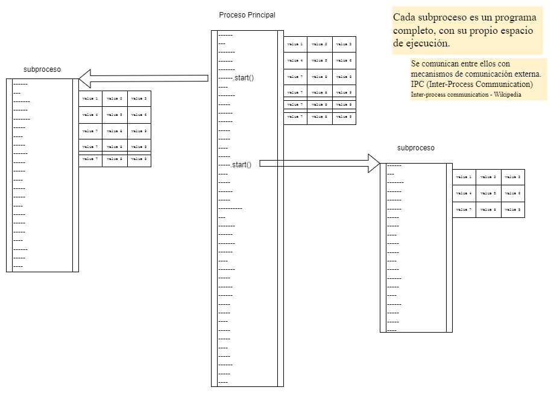
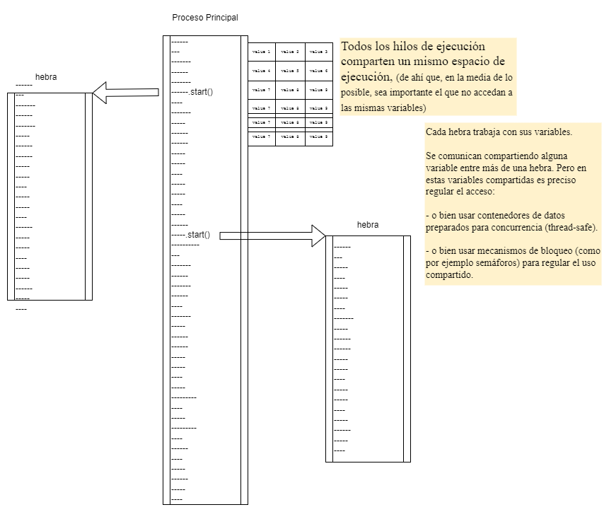

# Concurrente, Paralelo, Distribuido

- **Secuencial**  : diferentes tareas realizándose una a continuación de otra; una tarea no comienza hasta que haya terminado la anterior.

- **Concurrente** : diferentes tareas realizándose de forma solapada o intercalada, coordinándose (o siendo coordinadas) para compartir recursos.

- **Paralelo** : diferentes tareas realizándose simultáneamente, de forma independiente una de otra, cada una con sus propios recursos.

- **Distribuido** : diferentes tareas realizándose en distintas máquinas, comunicadas entre sí.

Realizando tareas de forma secuencial, la relación entre tareas es clara y es fácil seguir el flujo de ejecución.

Realizando tareas de forma concurrente, paralela o distribuida, no hay ninguna garantia acerca del orden en que vayan a ejecutarse. Siempre es necesario tener en cuenta todas las posibilidades de interacción entre tareas.

Por tanto, se hace especialmente importante organizar los trabajos de forma que cada tarea sea lo más independiente posible de las demás. Minimizando y acotando claramente los puntos de interacción entre ellas.


## Algunas consideraciones teóricas

### Paralelizable , Concurrentizable

Si un trabajo se puede hacer a trozos autónomos ==> es paralelizable.

- ¿Cuántos trabajadores tenemos? -> n

- Dividir la tarea en n trozos independientes.

- Recoger los n resultados parciales y combinarlos.

Si un trabajo tiene varias tareas (más o menos) independientes ==> es concurrentizable.

- Asignar un trabajador para cada tarea.

- Determinar los puntos de intersección.

- Establecer los mecanismos adecuados de comunicación/coordinación.

### Intercambio de datos entre hilos de ejecución

Como regla general:

- A la hora de **leer**, no hay ninguna limitación; multiples hilos pueden estar leyendo un mismo recurso a la vez. 

  Aunque, ¡ojo!, tener siempre en cuenta que:

  - Si se va a trabajar sobre la información que se ha leido. Una escritura posterior de otro hilo puede invalidar esa información.

  - Si se está leyendo una información a trozos, cuidar que no haya posibilidad de que otro hilo modifique algo entre lectura de un trozo y de otro. De todas formas, con datos compuestos, mejor hacer toda la lectura de un golpe (en una sola operación atómica).

- A la hora de **escribir**, cada hilo que vaya a modificar algo lo ha de hacer en una sola operación atómica:
   1. Ha de reservarse (bloquear) el recurso a modificar.
   2. Realiza las operaciones de lectura/escritura/modificación que precise.
   3. Ha de liberar (desbloquear) el recurso.

  Durante el tiempo de bloqueo, ningún otro hilo puede usar ese recurso para nada.

### Coordinación entre hilos de ejecución

Algunos consejos:

- Modelar correctamente los límites de uso de los recursos compartidos. Y, obviamente, asegurar el correcto funcionamiento del bloqueo|desbloqueo de los mismos.

- Procurar que los recursos compartidos no se conviertan en cuellos de botella. Procurar que unos hilos no se molesten a otros cuando intenten usar esos recursos compartidos.

- Saber cuales son los puntos de pausa o de espera naturales de cada tarea. Aprovecharlos para hacer los intercambios de información en esos momentos.

Los tres grandes peligros: 

- Las INTERACCIONES DESTRUCTIVAS. Se producen cuando algún hilo estropea el trabajo de otro. Por ejemplo si no se respeta la atomicidad de las escrituras, y las modificaciones de un hilo interfieren con las de otro.

- Los BLOQUEOS MAL RESUELTOS. Pueden provocar desde esperas innecesarias que ralentizan el trabajo, hasta bloqueos mutuos que lo paralizan totalmente.

- Las INFORMACIONES NO VÁLIDAS: algo que se ha leido y se trabaja de acuerdo a lo leido; sin darse cuenta de que poco después de la lectura otro hilo ha modificado ese algo, invalidando el trabajo que se está realizando con la información anticuada.


### Asincronía

Las llamadas asíncronas (llamar a una función y continuar sin esperar a su resultado) se suelen utilizar allá donde la tarea la lleve un solo hilo de ejecución y se necesite no bloquearlo. 

Pero esta asincronía entre la petición y la respuesta:
 
- Hace complicado el mantenimiento estricto de estado entre distintas peticiones relacionadas. (Estado: información interna concerniente a una determinada tarea o cliente).

- Hace complicado garantizar el orden de respuesta a las distintas peticiones. Es decir, no se puede tener un control estricto de lo que sucede y cuándo sucede.

De ahí que la asincronía se tienda a utilizar junto con arquitecturas donde cada petición pueda tener una respuesta independiente (stateless architecture).

Por otro lado, comentar que una vez se hace una llamada asíncrona en algún punto del código, es obligatorio llevar a asincronía hasta el origen. Es decir, no se pueden mezclar partes síncronas y partes asíncronas en una misma operación. Por ejemplo, si al pulsar un botón en el interfaz de usuario se desencadena una acción que al final requiere realizar una llamada asíncrona a una API para solicitar datos; aunque el .await esté en la llamada a la API, toda la cadena de vuelta (API -> modelo -> controlador -> vista) acabarán siendo funciones asíncronas (requiendo que la vista tenga también capacidad de atender y cerrar la cadena asíncrona).

> Podria decirse que la asíncronicidad es "contagiosa". Un proceso asíncrono lleva a que otro que lo utiliza también deba ser asíncrono. Y, muchas veces, al final acaba obligando a que más y más procesos sean asíncronos. Hasta que todo el sistema acaba teniendo una arquitectura asíncrona.

La gran ventaja de las arquitecturas asíncronas es que aprovechan mejor los recursos (no desperdician ciclos de CPU) y que escalan muy bien (horizontalmente). Suele merecer la pena tener una arquitectura asíncrona (o una concurrente). Sobre todo si hay involucradas tareas que requieran esperar a mucho trabajo de la CPU (grandes cálculos) o esperar a tareas con un fuerte componente I/O (como por ejemplo acceder a servidores en la red).

> La única pega es que, al igual que con sus primas la concurrencia, el paralelismo y la distribución. Con la asíncronia se complica bastante la escritura y depuración del código.

> Tampoco hay que perder de vista que todas esas técnicas de delegación o de reparto de trabajos no son compatibles con ciertos tipos de tareas. Por ejemplo, todas aquellas que necesiten garantizar un orden exacto de ejecución (tareas [deterministas](https://en.wikipedia.org/wiki/Deterministic_algorithm)) o completar transacciones encadenadas involucrando diversos sistemas (tareas [ACID](https://en.wikipedia.org/wiki/ACID)).

¡importante!

Contrariamente a lo que pudiera deducirse, `await` no significa que la ejecución se queda en ese punto del código esperando al resultado. 

`await` significa que se asume que la función a la que se ha llamado devolverá el resultado "cuando pueda" (y, la procesaremos entonces). Mientras tanto, la ejecución del código principal sigue adelante. 

Es decir, en el fondo `await` es crea un 'callback' que entrega a la función llamada para que esta pueda avisar cuando termine de tener el resultado. En ese momento futuro, el punto que ha inciado el "awaiting" es retrollamado ('callback') para que pueda retomar el tema que había quedado pendiente. 

> `await` no es "me quedo esperando aquí", sino más bien "lo dejo para luego, avisame cuando lo tengas" ;-)


[Fundamentals of Asynchronous Programming: Async, Await, Futures, and Streams](https://doc.rust-lang.org/book/ch17-00-async-await.html)

[Fearless Concurrency](https://doc.rust-lang.org/book/ch16-00-concurrency.html)

## Algunas consideraciones prácticas para repartir tareas con Procesos

- **Proceso** : cada espacio aislado donde se está ejecutando un determinado programa independiente.



Por ejemplo, en Java:

[java.lang.ProcessBuilder](https://docs.oracle.com/en/java/javase/20/docs/api/java.base/java/lang/ProcessBuilder.html)

[ProcessBuilder.start()](https://docs.oracle.com/en/java/javase/20/docs/api/java.base/java/lang/ProcessBuilder.html#start())

Con esto, obtenemos un objeto de tipo [java.lang.Process](https://docs.oracle.com/en/java/javase/20/docs/api/java.base/java/lang/Process.html)


### Comunicación entre procesos

Tal y como se ha indicado, cada proceso es independiente. La única forma de comunicación entre ellos es externa. Por ejemplo:

- Los canales de entrada (in) o salida (out) del sistema operativo.

- Canales a través de la red local; por ejemplo, usando sockets.

- Usando almacenamiento en disco, a través de un archivo compartido.

- etc, etc. [IPC - Inter-Process Communication](https://en.wikipedia.org/wiki/Inter-process_communication)

Lo único que viene "de serie" y es lo que se utiliza habitualemnte. Es la posibilidad de que el proceso principal controle los canales de entrada (in) o salida (out) de los procesos secundarios.

Cuando arrancamos un programa desde la linea de comandos, el proceso de ese programa:
- recibe información a través de `stdin` (normalmente teclado)
- muestra información a través de `stdout` o `stderr` (normalmente pantalla).

Pero cuando arrancamos un programa (un proceso) desde el código de otro programa (otro proceso), los canales stdin, stdout y stderr físicos de la máquina están conectados al proceso padre. Los de los procesos hijo han de ser expresamente redirigidos.

Por ejemplo, en Java: [Handling Process Streams - Baeldung](https://www.baeldung.com/java-process-api#handlingprocess-streams)

Estos canales de comunicación (stdin, stdout y stderr) se utilizan siguiendo el clásico paradigma de "tuberias" (pipes) de Unix: un programa recibe una entrada desde su stdin, hace algo y vuelca el resultado sobre su stdout/stderr; donde otro programa ha enganchado su stdin... y así se van encadenando un programa tras otro... cada uno haciendo su parte del trabajo, hasta que el último devuelve el resultado final por su stdout/stderr.

Por ejemplo en este encadenamiento...
````
cat /var/log/syslog | grep -i 'error' | wc -l
````
...se ven tres programas que colaboran para obtener un resultado: `cat` lee y muestra el contenido del archivo, `grep` busca las lineas que contienen la palabra indicada y `wc` cuenta las lineas encontradas.

[Pipeline commands in Linux - Youtube](https://www.youtube.com/watch?v=5-wnAO5G7n0&list=PLSmXPSsgkZLuJKJhvL1U384aHesbVDekO&index=13)


## Algunas consideraciones prácticas para repartir tareas con Hebras

- **Hebra (thread)** : cada trozo de código de un programa que se está ejecutando de forma separada, dentro del proceso donde ese programa se ejecuta.



Por ejemplo, en Java: 

[java.lang.Thread](https://docs.oracle.com/en/java/javase/20/docs/api/java.base/java/lang/Thread.html)

[java.lang.Runnable](https://docs.oracle.com/en/java/javase/20/docs/api/java.base/java/lang/Runnable.html)


### Comunicación y coordinación entre hebras

Normalmente varias hebras se comunican a través de algún objeto común en el espacio de memoria del programa. 

En ese espacio, todas las hebras leen o escriben de forma compartida. De ahí que sea muy importante garantizar que las hebras no se van a interferir entre sí durante esas lecturas o escrituras.

#### atomicidad

Lo ideal es que cada una de las lecturas/escrituras sea atómica (se realice en un solo golpe, sin dar lugar a que nada se entrometa en la operación)

Por ejemplo, en Java se pueden usar:

- Alguno de los tipos de datos del paquete [java.util.concurrent.atomic](https://docs.oracle.com/en/java/javase/20/docs/api/java.base/java/util/concurrent/atomic/package-summary.html)

- Alguna de las [COLAS CONCURRENTES](https://docs.oracle.com/en/java/javase/22/docs/api/java.base/java/util/concurrent/package-summary.html#queues-heading) o  de las [COLECCIONES CONCURRENTES](https://docs.oracle.com/en/java/javase/22/docs/api/java.base/java/util/concurrent/package-summary.html#concurrent-collections-heading)


#### monitorización

En caso de no poder realizar lecturas/escrituras atómicas. Suele ser necesario recurrir a regular manualmente las partes comunes donde una hebra puede interferir con otra. Suele ser necesario "monitorizar" el acceso a cada parte común. 

Es decir, la hebra que accede a algo "monitorizado" lo bloquea para su uso exclusivo mientras lo esté utilizando. Cuando termina de utilizarlo, lo libera para que otra pueda usarlo.

##### bloqueos automáticos

Para los arreglos habituales, suele haber algún mecanismo más o menos sencillo de utilizar. 

Por ejemplo, en Java tenemos:

- La palabra clave [synchronized](https://www.baeldung.com/java-synchronized), que permite marcar expresamente funciones o partes críticas del código a ser monitorizadas. El bloqueo es automático al entrar en la primera línea de código del bloque sincronizado; y el desbloqueo también es automático al terminar con la última línea de ese bloque.

  nota: Además de regular el acceso a partes del código. Los objetos `synchronized` permiten también regular el flujo de la ejecución. Utilizando sus métodos:

    - [wait()](https://docs.oracle.com/en/java/javase/20/docs/api/java.base/java/lang/Object.html#wait())

    - [notify() , notifyAll()](https://docs.oracle.com/en/java/javase/20/docs/api/java.base/java/lang/Object.html#notify())

- La cola [SyncronousQueue](https://docs.oracle.com/en/java/javase/22/docs/api/java.base/java/util/concurrent/SynchronousQueue.html), que permite a una hebra escribir algo en una cola cuando otra está esperando a recoger algo de esa cola. De esta forma, ambas hebras pueden esperarse la una a la otra para intercambiarse una determinada información.


##### bloqueos manuales

Para arreglos más sofisticados, es necesario recurrir directamente a los mecanismos básicos de control de recursos.

Por ejemplo, en Java tenemos:

- [sincronizadores específicos](https://docs.oracle.com/en/java/javase/22/docs/api/java.base/java/util/concurrent/package-summary.html#synchronizers-heading), tales como los semáforos o las barreras.

- [mecanismos de bloqueo base](https://docs.oracle.com/en/java/javase/22/docs/api/java.base/java/util/concurrent/locks/package-summary.html), tales como los cerrojos (locks).


## apéndice

### algunos enlaces variados

[Some posts about to the fallacies of distributed systems](https://particular.net/blog/topics/fallacies)

[Some videos about to the fallacies of distributed systems](https://www.youtube.com/watch?v=8fRzZtJ_SLk&list=PL1DZqeVwRLnD3EjyciYAO82dT9Owiq8I5)

[Some posts related to architecture of distributed systems](https://particular.net/blog/topics/architecture)

[Fundamentals of Asynchronous Programming in Rust: Async, Await, Futures, and Streams](https://doc.rust-lang.org/book/ch17-00-async-await.html)

[Fearless Concurrency in Rust](https://doc.rust-lang.org/book/ch16-00-concurrency.html)


### un ejemplo sobre el que pensar...

Por ejemplo, una transferencia de dinero entre dos cuentas bancarias.

Realizada garantizando ACID y tratando los saldos de ambas cuentas como recursos exclusivos:
- Se bloquean los saldos de A y de B
- Se lee el saldo de A y, si hay saldo suficiente, se le resta la cantidad a transferir.
- Se suma a B la cantidad a transferir.
- Si todas las operaciones han sido correctas, se liberan los dos bloqueos. 

Si alguna operación ha tenido problemas, se dejan los dos saldos tal como estaban antes de intentar la transferencia, se avisa al usuario y se liberan los bloqueos.

Realizada como tarea cooperativa entre procesos que manipulan saldos:
- Se anota en una cola la operación de transferir una cantidad de A a B
- Cuando un proceso que manipula saldos recupera esa operación de transferencia de la cola. Lee/comprueba/resta la cantidad del saldo de A y anota en la cola una nueva operación de ingresar en B esa cantidad. Si A no tiene saldo suficiente (si falla la lectura/comprobación/resta), devuelve a la cola la operación de transferencia.
- Cuando un proceso que manipula saldos recupera la operación de ingreso de la cola. Realiza el ingreso en B.

nota: 

En la primera de las formas, pensar en cómo puede afectar la sobrecarga de trabajo bloqueo-transaccional en un sistema que ha de procesar transferencias de millones de clientes por segundo. (Un millón de transferencias por segundo implica que cada una se ha de completar en menos de 1 microsegundo.)

Pensar también en los posibles estorbos entre procesos paralelos. (Por ejemplo, uno intentando transferir de A a B, bloquea a otro intentando transferir de A o de B a C) 

nota: 

En la segunda de las formas, pensar en qué sucede cuando un cliente quiere saber su saldo en un momento dado. (El sistema ha de consultar el saldo, más todas las operaciones pendientes en la cola para esa cuenta. Realmente se tendria que comunicar el saldo en tres partes: lo que hay consolidado, lo que está pendiente de sacar y lo que está pendiente de ingresar.) 
Pensar también cómo se decidirá si permitir o no al cliente realizar una cierta operación en función de esas tres partes (¿Cuánto de la diferencia positiva entre pendiente de ingresar y pendiente de sacar se le permite utilizar?)

Pensar también en las implicaciones en un sistema que ha de procesar transferencias de millones de clientes por segundo. (Anotar en una cola es rápido, múltiples procesos independientes pueden ir anotando rápidamente sin estorbarse unos a otros) (Leer de una cola es rápido, se pueden disponer múltiples procesos independientes para ir recuperando de la cola y realizando las operaciones.) (Pero realizar consultas/chequeos/consolidación de saldos en cada cuenta es costoso y solo puede realizarse de cuando en cuando; ¿cuántas operaciones sin procesar aún pueden llegar a anotarse para una misma cuenta ?)

conclusión: 

Todo en esta vida es un compromiso. Lo que mejora unos aspectos, suele fastidiar otros. De ahí la importancia de escoger la arquitectura y los algoritmos más adecuados para según que aspectos deseemos priorizar.....

Por ejemplo. En un sistema con "pocas" transferencias (o con enormes recursos ultrarápidos de procesamiento) la manera más rentable de proceder es la primera. En un sistema con transferencias "a escala Internet" (y con buenos recursos financieros para compensar posibles problemas derivados de la falta de integridad ACID) la manera más rentable de proceder es la segunda.
